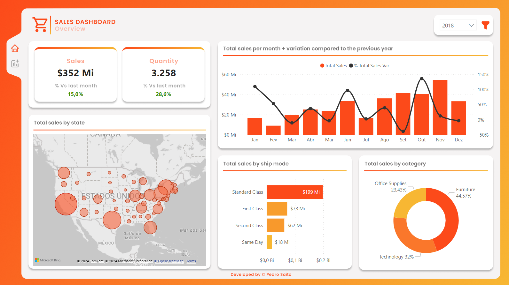
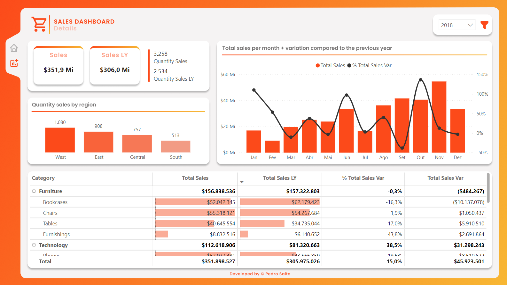

# 📊 Superstore Sales Dashboard

Projeto em PowerBI que mostra um dashboard com base em um dataset do Kaggle. Este projeto tem como objetivo mostrar os principais insigths e resultado de vendas.

## 🧑‍💻 Tecnologias usadas:

## 🎯 Sobre os insights e resultados

* Total de vendas e contagem de vendas com comparação ao ano anterior.
* Total de vendas ao longo dos meses com a variação comparado ao ano anterior.
* Quantidade de vendas/Total de vendas por estado.
* Total de vendas por tipo de envio.
* Quantidade de vendas/Total de vendas por categoria do produto.
* Análise de vendas por categoria e subcategoria.
* Quantidade de vendas por região.

## 💻 Mostrando o dashboard

  1. Visão geral:
  

  2. Detalhes:
  

## 🎲 Mais:

Projeto online: [Superstore Sales](https://app.powerbi.com/view?r=eyJrIjoiOWM5YWEyNDgtNzIzYi00ZjA4LTk0OGUtYmJjYmE1YTBmNWZmIiwidCI6ImUyOTI3YmMyLTg2MmMtNGRiZS1iMmZiLTk5Y2QzMGQ4Y2YyYiJ9)

Projeto inicial usado: [Superstore sales - Kaggle](https://www.kaggle.com/datasets/rohitsahoo/sales-forecasting)

Projeto no linkedin: [Link]()

## 📱 Contato:

* [Linkedin](https://www.linkedin.com/in/pedrosaito1/)
* [Email](mailto:contato.pedrosaito@gmail.com)

    

